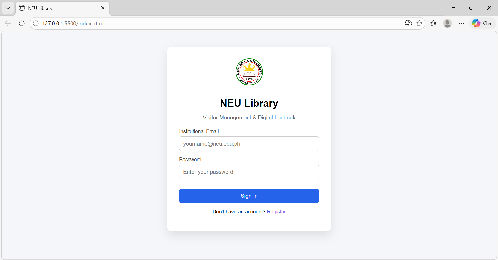
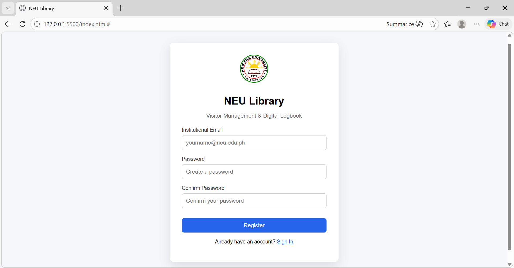
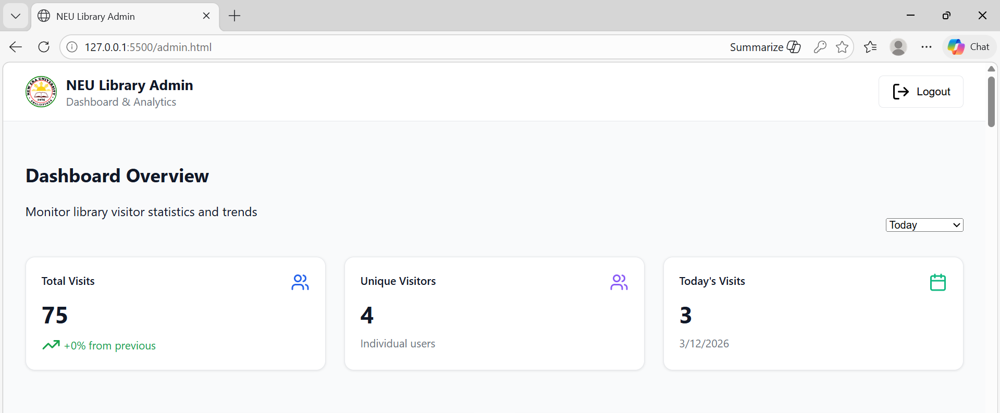
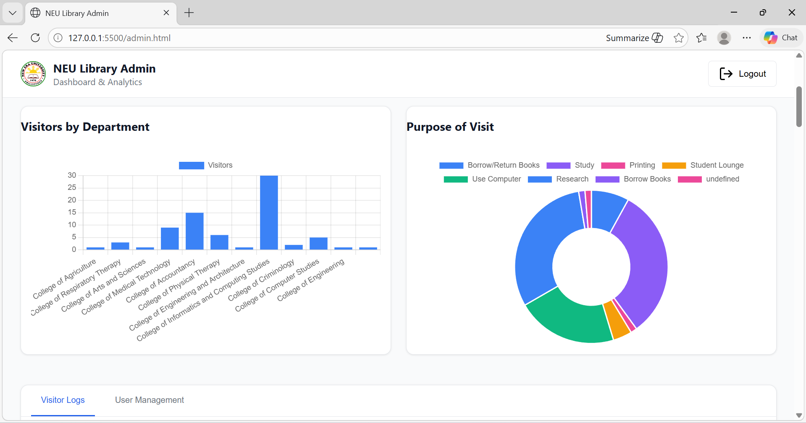
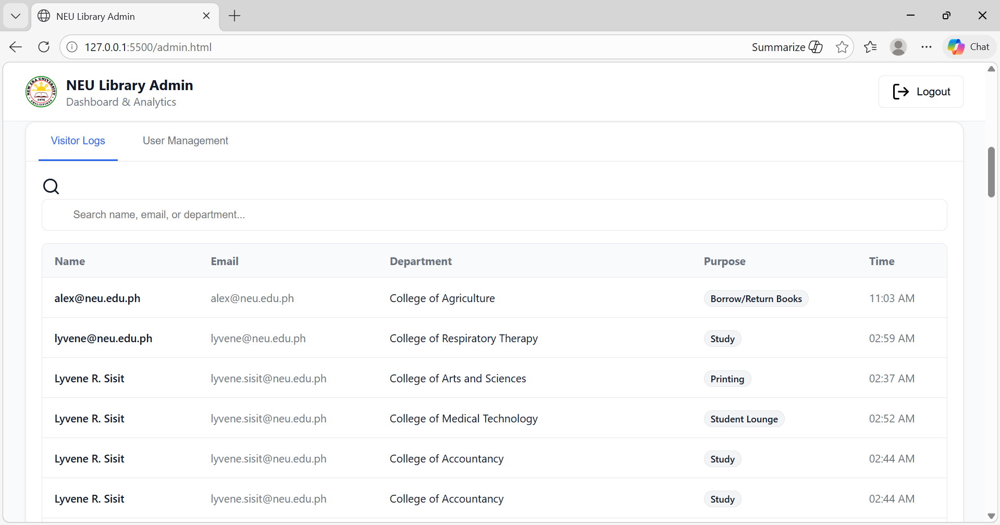
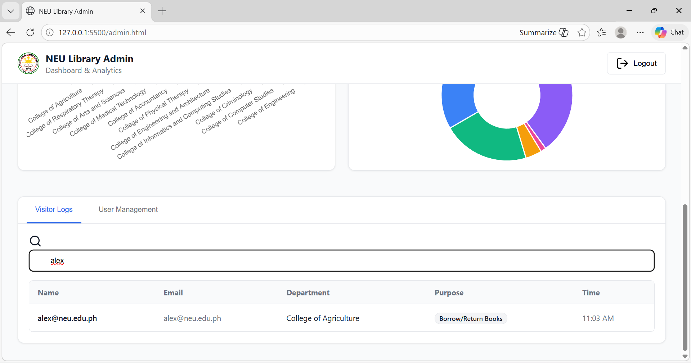
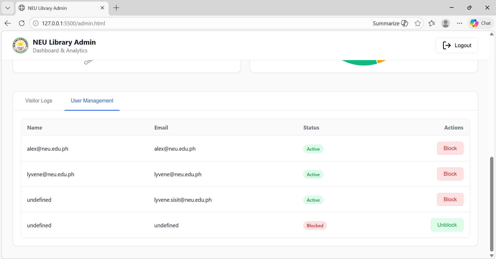

# NEU Library Visitor Management System

A web-based library visitor management system for **New Era University** that allows students to check in and administrators to monitor visitor statistics in real-time.

---

## Live Features

- Student login & registration using NEU institutional email
- Library check-in form (purpose of visit & college)
- Admin dashboard with real-time analytics
- Visitors by department (bar chart)
- Purpose of visit breakdown (doughnut chart)
- Visitor logs with search functionality
- User management — block/unblock users
- Time filter (Today, Last 7 Days, Last 30 Days)

---

## Tech Stack

| Technology | Usage |
|---|---|
| HTML, CSS, JavaScript | Frontend |
| Firebase Authentication | User login & registration |
| Firebase Firestore | Real-time database |
| Chart.js | Analytics charts |
| Lucide Icons | UI icons |

---

## Project Structure
```
neu-library/
├── index.html        # Visitor login & registration page
├── expage.css        # Visitor page styles
├── expage.js         # Visitor page logic & Firebase auth
├── admin.html        # Admin dashboard
├── dmnview.css       # Admin dashboard styles
└── dmnview.js        # Admin logic, charts & Firestore queries
```

---

## How to Run

1. Clone the repository
```bash
git clone https://github.com/lyvene17/neu-library-system.git
```

2. Open the folder in **VS Code**

3. Install **Live Server** extension in VS Code

4. Right-click `index.html` → **Open with Live Server**

---

## User Flow

### Student
1. Go to `index.html`
2. Register using `@neu.edu.ph` email
3. Log in with email & password
4. Fill in purpose of visit & college
5. Submit check-in

### Admin
1. Go to `index.html`
2. Log in with `admin@neu.edu.ph`
3. Automatically redirected to `admin.html`
4. View analytics, visitor logs, manage users

---

## Firebase Setup

- **Platform:** Firebase (Google)
- **Project ID:** neu-library-system-ffbc9
- **Services used:**
  - Firebase Authentication (Email/Password)
  - Cloud Firestore

### Firestore Collections

| Collection | Description |
| `visits` | Stores all visitor check-in records |
| `blockedUsers` | Stores blocked user emails |

---

## Admin Dashboard

- **Total Visits** — overall visit count
- **Unique Visitors** — individual users
- **Today's Visits** — visits for the current day
- **Visitors by Department** — bar chart
- **Purpose of Visit** — doughnut chart
- **Visitor Logs** — searchable table
- **User Management** — block/unblock students

---

## Developer

- **Name:** Lyvene R. Sisit
- **School:** New Era University
- **College:** College of Informatics and Computing Studies

## Test Credentials

### Admin Access
- **Email:** admin@neu.edu.ph 
- **Password:** qwerty123 

### Student Access
- **Email:** Register using any @neu.edu.ph email 
- **Password:** Create your own password during registration 

## Screenshots

### Login Page


### Register Page


### Check-in Form
.png)
.png)

### Admin Dashboard


### Charts


### Visitor Logs


### Search User


### User Management

